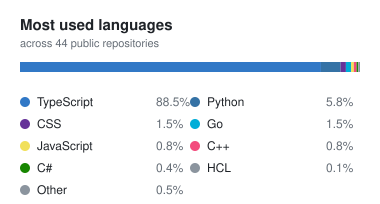

<h1 align="center">Jonathan Cho</h1>

  <b>Backend &amp; AI systems engineer — English / 日本語</b>

  <a href="README.md">English</a> · <a href="README.ja.md">日本語</a>

  TypeScript and React across the front end · streaming speech pipelines in Python · 
  event-driven ingestion in Go · .NET services over well-modeled data — 
  and the realtime clients, maps and dashboards that sit on top of them.

  
  
  
  

---

## 声 koe — bilingual voice AI, assembled

**[github.com/jon-jc/koe-harness](https://github.com/jon-jc/koe-harness)** · `Python 3.11` `TypeScript` `FastAPI` `WebSocket` `Docker` `Terraform`

Streaming ASR, speaker diarization and an LLM writing 議事録 (meeting minutes), orchestrated behind
one plugin kernel and held to explicit **latency, cost and quality budgets**. A voice product is never
one model — it's three models and a great deal of glue, and the glue is the engineering.

**Japanese is a design constraint, not a locale string.** WER is close to meaningless for a language
with no word spaces, so scoring is CER and every WER carries the name of the tokenizer that produced
it. 漢数字 conversion is gated on MeCab POS tags, because `一般`, `一緒` and `十分` all open with
numeral kanji and none are numbers. Endpointing gives Japanese 900 ms of silence tolerance against
English's 650 — JA speakers pause *before* sentence-final particles, which is where negation and
tense live, so an English-tuned endpointer removes the verb.

**Hallucination detection reduced to a string operation.** The minutes schema requires a verbatim
`source_quote` on every claim, so verification is a substring search: either the quote is in the
transcript or it isn't. No judge model, no second call, effectively zero cost. Unsupported claims are
*dropped*, not flagged — an action item marked "unverified" still lands in someone's backlog.

**Model choice is a runtime decision.** Backends register carrying their cost, speed and expected
quality as data; a request declares `Budget.realtime()` or `Budget.accurate()`, and the router
eliminates on hard constraints before ranking what survives. Measured error rates replace vendor
priors, so routing converges on reality rather than marketing.

**Uncertainty is quantified, not asserted.** Bootstrap confidence intervals on every number, paired
permutation tests for A/B, resampling at the utterance level because character-level errors are
correlated and independent resampling would produce intervals too narrow to be honest. CI gates fail
on significant regressions, never on run-to-run noise.

Voicing-aware VAD lifts precision <b>0.716 → 0.954</b> with recall unchanged and false alarms at 0.00/min · 917 tests · <code>mypy --strict</code> clean · eight CI jobs including a MeCab-present/absent matrix · ships as a Docker service, a FastAPI server and a Windows desktop app · runs fully offline against Ollama / LM Studio / llama.cpp with no API key

---

## 重ね Kasane — realtime Japanese→English video translation

**[japanese-live-transcriber.vercel.app](https://japanese-live-transcriber.vercel.app)** · `Python` `FastAPI` `Celery` `Redis` `faster-whisper` `UniDic` `Next.js` `Docker`

A self-hosted Japanese→English video translator. Subtitles publish *as* the video processes, and every
synchronized Japanese word stays clickable for readings, definitions, confidence and contextual
examples. The complete translation path runs in your own containers — no hosted model API, no key,
no metered service.

**Playback never waits for inference.** The worker prepares the first 12 seconds, then stays ahead
with bounded overlapping audio windows pushed to the browser over SSE. Durable Redis snapshots and
adaptive polling mean an interrupted connection recovers instead of restarting.

**Morphology, because Japanese has no spaces.** Fugashi + UniDic tokenization drives a locally indexed
JMdict lookup with Tatoeba example sentences — readings, Hepburn, parts of speech, bilingual SRT export.

**Work is deduplicated at the fingerprint.** Public analyses are keyed by video ID and inference
profile; concurrent requests for the same video share one in-flight task, tracking parameters don't
fork it, and uploads never enter the shared cache.

**Production ops, not a demo.** PRs run lint, types, builds, dependency audits, analyzer tests, Compose
validation, container builds and a same-origin health smoke test. Merges publish immutable images to
GHCR with OCI SBOMs and provenance; deploys are opt-in to a labeled self-hosted runner behind a
protected environment, with Caddy terminating TLS and everything else on a private network.

---

## League Counters — multi-region match data, aggregated per patch

**[https://league-counters.vercel.app](https://league-counters.vercel.app)** · `TypeScript` `Next.js 16` `React 19` `Tailwind v4`

A counter-pick and tier tracker built on ranked match data pulled from every Riot platform and
recomputed as each patch settles. The interesting part isn't the UI — it's that most sites in this
category publish numbers that are statistically meaningless, and this one doesn't.

**Small samples are shrunk, not published.** Champion win rates regress toward a prior worth 150
pseudo-games and matchups toward 40, with hard floors of 20 games to rank and 8 to show a matchup.
A 71% win rate over nine games is noise, and presenting it as a recommendation is the whole failure
mode of the genre.

**Matchups are win-rate *deltas*, not raw percentages.** A champion that wins 54% of all games is not
countering anything by winning 54% of a matchup — the baseline has to come out first.

**Merging regions is what makes the data usable.** The largest single region scores 722 lanes; the
merged global view scores **3,090**, which is the difference between "no data for this matchup" and
an answer. Tier score is `0.72·z(win rate) + 0.28·z(presence)`, so popularity informs the ranking
without letting a niche pick that quietly wins get buried.

**Ingestion respects the source.** A token bucket holds to Riot's 20 req/s and 100-per-2-minutes
limits across concurrent workers, so a full multi-region crawl runs to completion instead of getting
throttled halfway through.

---

## Fluxgate — distributed telemetry ingestion

**[github.com/jon-jc/fluxgate](https://github.com/jon-jc/fluxgate)** · `Go` `GCP Pub/Sub` `PostgreSQL` `Cloud Run` `Terraform` `OpenTelemetry`

Three stateless services that accept high-volume metric points over HTTP, publish them onto a durable
event bus, aggregate them into event-time windows across a worker fleet, and serve the rollups back
over a query API.

**202 means the broker has it.** The response is withheld until Pub/Sub acknowledges. The faster
answer is to buffer in-process and reply immediately — which is a lie about durability, told at
exactly the moment durability is the whole product.

**Exactly-once accumulation under redelivery**, via a delivery ledger keyed by `(batch, window)`
where the rollup and the ledger entry commit in the same transaction. Redelivery is normal operation
for a broker; double-counting a metric is not.

**Partial success is reported, not rounded off.** One bad point returns which points landed and why
the others didn't, rather than rejecting the batch and making the client bisect it.

**Cardinality is bounded by construction** — labels come from route patterns, never raw paths, so a
metrics backend can't be taken down by a caller with creative URLs. Circuit breakers turn a dependency
outage into fast 503s instead of a timeout queue; a three-phase drain keeps deploys from shedding.

<b>8,970 points/s</b> sustained at p99 <b>60.7 ms</b> · watermark lag 4.2 s against a 10 s window · fuzz targets, integration tests against real services, and Terraform for the entire GCP footprint including per-service accounts, dead-lettering and four alert policies

---

## SpillSense — environmental data platform & GIS

**[spillsense.vercel.app](https://spillsense.vercel.app)** · [src](https://github.com/jon-jc/spillsense) · `C#` `ASP.NET Core` `EF Core` `SQL Server / SQLite` `Leaflet`

A spill incident data management and analytics platform for Washington State, modeled on how
spill-response programs actually work rather than on what a CRUD scaffold produces.

**Auditable ETL intake.** Every row is validated against its full rule set at once, and rejected rows
are *quarantined verbatim* with each failure reason attached rather than dropped — because the row
someone has to fix is the row you just deleted. Re-importing a file is idempotent by natural key.

**Spatial validation at the boundary.** Statewide WGS 84 bounds catch swapped or malformed coordinates
before they reach the database; all 39 counties are seeded with FIPS codes and Department of Ecology
regional assignments, so geography is reference data rather than free text.

**Two deployment targets, one contract.** An ASP.NET Core system of record owning the database and
intake pipeline, plus a serverless read replica serving a published snapshot — held together by 109
automated tests: xUnit integration tests running real migrations, and `node:test` contract tests that
stop the two hosts drifting apart.

Bounding-box spatial queries, RFC 7946 GeoJSON, statistical rollups, annual reports and CSV export across 11 OpenAPI-documented endpoints · clustered incident map, trend and substance analytics, URL-encoded shareable filter state, and an intake audit view

---

## More TypeScript & React

| Project | What it does | Stack |
|---|---|---|
| **[NEO TOKYO TRANSIT](https://tokyo-train-map.vercel.app)** · [src](https://github.com/jon-jc/tokyo-train-map) | 22 lines and 269 stations of Tokyo rail in explorable 3D — JR, Metro, Toei, Yurikamome, Rinkai — trains animated bidirectionally against their schedules. Doubles as a working journey planner: Dijkstra with realistic transfer penalties and exit-level wayfinding, bilingual throughout. | `Next.js 15` `React 19` `three.js` `R3F` `zustand` |
| **[ChordLab](https://chord-finder-ten.vercel.app)** · [src](https://github.com/jon-jc/chord-finder) | Music analysis entirely in the browser, nothing uploaded. Chord recognition over 145 states smoothed by a Viterbi decoder, Krumhansl–Schmuckler key detection, note-level transcription to playable guitar tab, MIDI export. FFT, chromagram, onset detection and pitch estimation written from scratch — **zero runtime dependencies**, all of it off the main thread in a Web Worker. | `TypeScript` `Web Audio` `Web Workers` `DSP` |
| **[LanguageRooms](https://github.com/jon-jc/language-rooms)** | Persistent practice rooms by language and CEFR level on a self-hosted LiveKit SFU: multi-party video and voice, shared whiteboard with photo upload, host controls, active-speaker detection and connection-quality indicators. Moderation, reporting and a review queue are a first-class subsystem rather than an afterthought. | `Next.js` `LiveKit` `Prisma` `Postgres` `JWT` |
| **[Tokyo Move-in Cost Calculator](https://apartmentfeesjapan.vercel.app)** · [src](https://github.com/jon-jc/apartmentfeesjapan) | Japanese leases front-load 4.5–6 months of rent. This models the entire 初期費用 stack — deposit, key money, agency, guarantor, insurance — against a choropleth of all 23 wards on live SUUMO / HOME'S data. Ward boundaries are compiled to ~28 KB of precomputed SVG paths at build time; 23 ward guides regenerate daily on ISR. Fully bilingual. | `Next.js` `TypeScript` `ISR` `i18n` |
| **[Portfolio](https://jon-jc.vercel.app)** · [src](https://github.com/jon-jc/portfolio) | Content-driven site where projects, experience and skills are data — routes, sitemaps, metadata and per-project social cards all generate from it at build time. Command palette with fuzzy matching, pointer-tracking cursor, scroll-triggered reveals, hand-drawn SVG posters from seeded randomness, a print-optimized resume route. Every route prerendered, no client-side fetching. | `Next.js 16` `React 19` `TypeScript` `Motion` |

---

## What I work with

**Front end** — TypeScript, React 19, Next.js (App Router), Tailwind CSS, three.js, Motion, WebSocket & SSE, WebRTC/LiveKit, Web Audio & Web Workers, i18n, accessible and themeable UI

**Backend & data** — Go, C#, ASP.NET Core, EF Core, Python, FastAPI, Node.js, PostgreSQL, SQL Server, Redis, SQLite, Prisma, REST/OpenAPI, event-driven architecture, ETL pipeline design

**AI & audio** — streaming ASR, speaker diarization, LLM orchestration and guardrails, evaluation harnesses (CER/WER/DER, bootstrap CIs, regression gates), VAD and endpointing, DSP

**GIS & visualization** — Leaflet, GeoJSON, spatial queries, coordinate-system validation, choropleths, Chart.js

**Delivery** — Docker, Terraform, GitHub Actions, GCP (Pub/Sub, Cloud Run), AWS (ECS Fargate), Vercel, xUnit, pytest, Vitest, integration & contract testing, fuzzing

---

## 📊 GitHub

  
  <picture>
    <source media="(prefers-color-scheme: dark)" srcset="assets/top-languages-dark.svg" />
    
  </picture>

The language card is generated from the GitHub API and committed to this repo by
<a href=".github/workflows/language-card.yml">a scheduled workflow</a> — no third-party stats service to rate-limit or go down.

---

  <i>Open to software engineering roles in the US and Japan — 日英バイリンガル対応可。 
  <a href="mailto:Jonathancho.jc@gmail.com">Jonathancho.jc@gmail.com</a> · <a href="https://linkedin.com/in/jon-jc">LinkedIn</a> · <a href="README.ja.md">日本語版</a></i>

